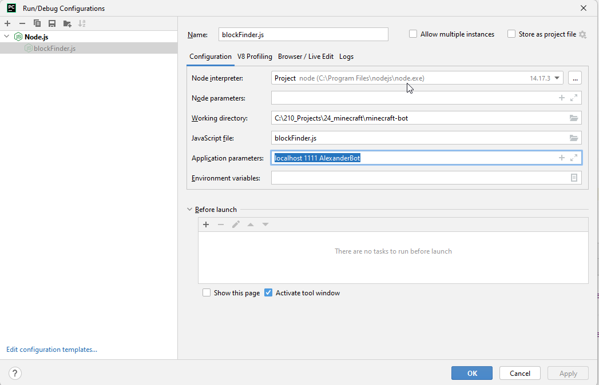

# minecraft-bot
A mineflayer minecraft bot that helps the user with different tasks. 

## Compatibility
This mineflayer bot runs in Minecradft 1.19.3

## How to Install
1. Install npm 9.6
2. in the root folder of the project run the following: 
```
npm install mineflayer
npm install mineflayer-pathfinder
npm install mineflayer-collectblock
npm update

```

## How to run
1. Start Minecraft and open a single player game to LAN in mode survival to let the bot collect things
2. Connect with the bot

